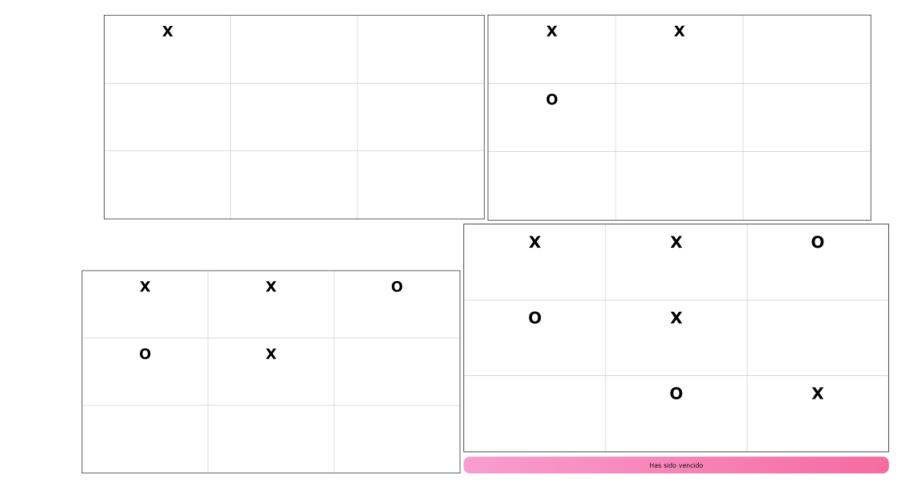

# Tictactoe
An implementation of tictactoe alrotithm in javascript, 

1. Clone the repository or download as zip 

```sh
git clone https://github.com/Fercho524/Tictactoe
```

2. Open with the web browser the file index.html and test the code, if want to see the code , open the developer tools using F12 in your web browser or open it with visual studio code.



Play Examples